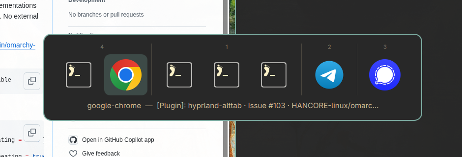

# hyprland-alttab

A visual **Alt+Tab window switcher** for the [Hyprland](https://hyprland.org/) Wayland compositor.

The recommended implementation is an **[Omarchy](https://omarchy.org/) shell plugin** (QML,
hosted by the `omarchy-shell` Quickshell process). Two legacy standalone implementations —
a **Rust** GTK4 binary and a **Python** prototype — are kept in the repo.



```
omarchy-plugin/   Omarchy shell plugin (QML) — recommended
rust/             Legacy standalone GTK4 binary
python/           Legacy prototype
```

## Features

- 🪟 **Visual switcher** on the layer-shell `Overlay` layer with exclusive keyboard focus
- 🗂️ **Grouped by workspace** (active first), sorted by recency (`focusHistoryID`), pinned windows excluded
- 🖼️ **App icons** resolved from `.desktop` files (id variants, `StartupWMClass`, title match for Chrome PWAs)
- 🎨 **Theme-aware** — follows the active Omarchy theme automatically
- ⌨️ Tab/Right → next, Shift+Tab/Left → previous, Return → activate, Escape → cancel,
  releasing ALT/SUPER → activate; hover selects, click activates
- 🫀 Stays open while ALT or SUPER is physically held (verified via `hl.is_key_down` when no
  keyboard event reaches the overlay)

## Install (Omarchy plugin)

```bash
omarchy plugin add https://github.com/c4software/hyprland-alttab --enable
```

For local development, symlink a checkout instead and enable it:

```bash
ln -sfn "$PWD/hyprland-alttab" ~/.config/omarchy/plugins/vbrosseau.alttab
omarchy plugin enable vbrosseau.alttab
```

Then bind it — in `~/.config/hypr/bindings.lua` (or `customisation.lua`):

```lua
hl.unbind("ALT + TAB")
o.bind("ALT + TAB", nil, hl.dsp.global("omarchy-alttab:next"), { repeating = true })
hl.unbind("SUPER + TAB")
o.bind("SUPER + TAB", nil, hl.dsp.global("omarchy-alttab:next"), { repeating = true })
hl.layer_rule({ match = { namespace = "omarchy-alttab" }, no_anim = true })
```

Finally `omarchy restart shell`, then `hyprctl reload` and check `hyprctl configerrors`.
The shortcut must appear in `hyprctl globalshortcuts`. Manual trigger for testing:

```bash
hyprctl dispatch 'hl.dsp.global("omarchy-alttab:next")'
```

See [`omarchy-plugin/README.md`](omarchy-plugin/README.md) for details.

### Uninstall

```bash
omarchy plugin remove vbrosseau.alttab --yes
```

Then remove the two binds and the layer rule from your Hyprland config and `hyprctl reload`.
The plugin never modifies your configuration files itself.

## Why a shell plugin?

The QML plugin runs as a `service` inside the long-lived `omarchy-shell` process:

| Legacy (Rust/Python) | Plugin (QML) |
|---|---|
| Daemon + Unix socket + PID files | The resident shell process |
| One-shot GTK switcher process | `LazyLoader` → `PanelWindow` in-process |
| `--focus-address` helper process | `Hyprland.dispatch()` after close |
| Spawn guard against double-launch | An `open` boolean |
| Parses theme files itself | Shell `Color` singleton (live theme) |
| Needs an autostart entry | Loaded by the shell every session |

---

## Legacy implementations

Both are standalone programs that predate the plugin, driven by a daemon and their own
Unix sockets. They are not installed, invoked or required by the plugin.

```
alttab                      Starts the daemon if needed, sends "tab" (bind this)
alttab --daemon             Starts the daemon in the background
alttab --show               Shows the GTK4 switcher (one-shot)
alttab --kill               Stops the daemon
alttab --focus-address ADDR Focus a window by Hyprland address
```

Build instructions, architecture and runtime details: [`rust/README.md`](rust/README.md).

## License

[MIT](LICENSE)
